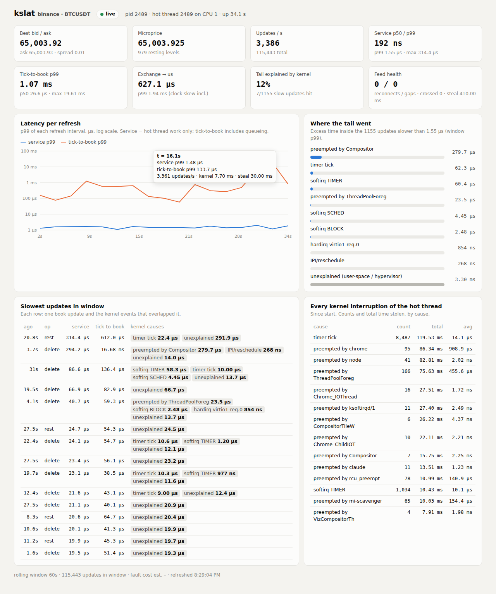
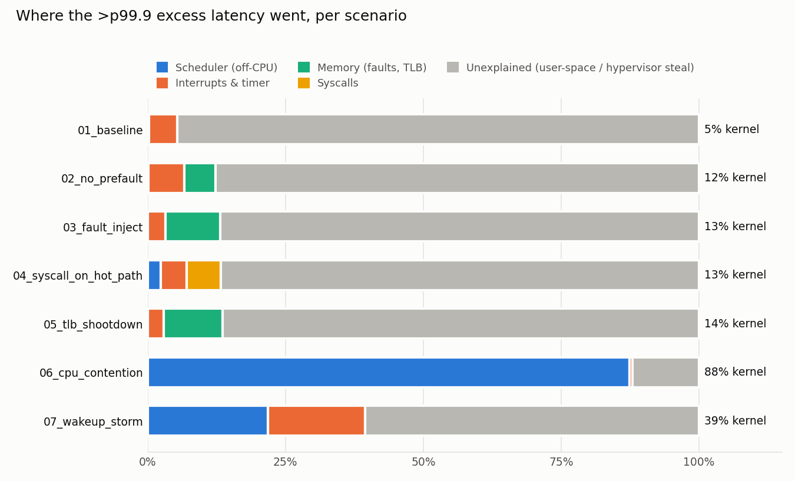

# kslat: kernel-level tail-latency attribution for trading systems

When an order-book update takes 40 µs instead of 80 ns, `perf` and `osnoise` can tell you
the CPU was noisy. They can't tell you **which update** got hurt or **what the kernel was
doing inside it**. kslat answers that per update, live, on real exchange data:

> delete @ 3.7 s ago: service 294 µs, tick-to-book 16.7 ms. Preempted by Compositor 280 µs,
> reschedule IPI 0.3 µs, 14 µs unexplained



It joins two streams on the same clock (`CLOCK_MONOTONIC` = `bpf_ktime_get_ns()`):

1. **Engine spans.** A C++ limit order book fed by a live exchange feed (or a synthetic
   flow) records `(t_rx, t_start, t_end)` for every update.
2. **Kernel events.** An eBPF tracer records everything that can take time from the hot
   thread: off-CPU time (and exactly who ran instead), hardirqs, softirqs, x86 system
   vectors (timer tick, IPIs, TLB shootdowns), page faults, syscalls, direct reclaim and
   compaction.

The analyzer assigns every nanosecond of each slow update to one cause, over a rolling
window (live dashboard) or a whole run (offline report).

## Live mode

```bash
make
sudo ./live.sh bitstamp            # L3: every individual BTC/USD order, add / change / delete
sudo ./live.sh binance BTCUSDT     # L2: depth diffs every 100 ms
# open http://127.0.0.1:8080
```

| feed | what arrives | how the book is built |
|---|---|---|
| Bitstamp `live_orders_<pair>` | every order: created / changed / deleted, with order id | REST per-order snapshot (`order_book?group=2`), then stream events newer than its microtimestamp |
| Binance `<sym>@depth@100ms` | changed price levels, absolute qty | REST depth snapshot + documented `U`/`u` sequence sync; a gap triggers a re-snapshot |

Tick and lot sizes are fetched from the venue (`trading-pairs-info`, `exchangeInfo`). You
can override them with `--tick/--lot`; if `rejected` climbs in the status, the tick is wrong.
Reconnects happen automatically on disconnect or on Bitstamp's `bts:request_reconnect`.

Pipeline (threads):

```
 feed thread (aux CPU)           hot thread (pinned)             writer thread (aux CPU)
 socket read -> t_rx             busy-poll SPSC                  spans.bin (append, 200ms flush)
 JSON parse, price -> ticks  ->  apply to book, microprice   ->  status.json (2x/s)
 snapshot/sequence sync          span {t_rx, t0, t1}
                                        ^ kernel events via eBPF (tracer on aux CPU) -> events.bin
                                                              kslat_live.py tails both -> :8080
```

- **service** = `t1 - t0`: time the hot thread spent on one update.
- **tick-to-book** = `t1 - t_rx`: from socket read to book updated, including JSON parsing
  and queueing behind earlier updates.
- **exchange → us** = our `CLOCK_REALTIME` at receive minus the exchange timestamp. This
  includes NTP skew, so read it as a trend, not an absolute.

The dashboard also shows feed health (reconnects, sequence gaps, and a **crossed-book
counter** that must stay 0), hypervisor steal on the hot CPU, and every kernel
interruption of the hot thread since start.

`./live.sh mock` runs everything against `scenarios/mock_exchange.py`, a local server that
speaks both exchange protocols (WebSocket + REST, chunked responses, pings, optional
sequence gaps). Use it for development without network access.

Options (env for `live.sh`): `PORT`, `HOST` (use `0.0.0.0` to view from another machine),
`CPU` (hot core), `AUX_CPU`, `WINDOW` (rolling window seconds), `DURATION`, and
`EXTRA="--no-prefault"` etc. to add a known bug while watching live.

### What live feeds showed (tested against the mock; real feeds need your machine)

- **Cold caches dominate at real message rates.** At ~800 updates/s, service p50 is
  ~400 ns vs 72 ns under a 500k/s synthetic load. The hot thread idles between updates and
  its cache lines go cold. No kernel event is involved, and kslat correctly reports this as
  *unexplained*.
- **Tick-to-book is dominated by the feed thread, not the book.** p50 7 µs vs service
  400 ns. The fix is in parsing and handoff, not matching.
- **The dashboard caught a real noisy neighbor.** An `npm install` + Chromium running
  during a test preempted the hot thread for up to 616 µs, and showed up by name.

## Validation: known causes, synthetic load

Each scenario injects a known cause. Ground truth is stored per span and checked.
Setup: 2 vCPU Firecracker VM, 2M updates @ 500k/s, hot thread on CPU 1, everything else
on CPU 0.



| scenario | p99.9 | max | tail explained | top cause (share of >p99.9 excess) | ground truth |
|---|---|---|---|---|---|
| 01 baseline | 5.3 µs | 9.2 ms | 5% | timer tick | — |
| 02 pool not prefaulted | 2.4 µs | 5.7 ms | 12% | page fault, timer tick | — |
| 03 injected page faults | 5.1 µs | 1.4 ms | 13% | page fault | **100% recall / 100% precision** |
| 04 `write()` on hot path | 2.6 µs | 2.4 ms | 13% | syscall write | **100% recall / 100% precision** |
| 05 sibling thread `munmap()` | 1.7 µs | 1.7 ms | 14% | **TLB shootdown IPI** (10.8k IPIs, p50 2.9 µs) | — |
| 06 CPU hog on same core | 1.8 µs | 8.3 ms | **88%** | preempted by `sh` | — |
| 07 wakeup storm on same core | 5.4 µs | 2.7 ms | 39% | preempted by `python3`, timer tick | — |

`./scenarios/run_all.sh` reproduces all of these. Per-run reports are in
`results/<run>/report.md`.

- **Known causes are found exactly.** 1,000–2,000 injected faults/syscalls per run, all
  matched to the right updates, no false positives.
- **Most of the unexplained tail is outside the guest kernel.** On this VM it's hypervisor
  steal (vCPU descheduled by the host) plus user-space effects. kslat cross-checks
  against `/proc/stat` steal: 25 ms unexplained vs 40 ms steal (scenario 05), 21 vs 30
  (04), 101 vs 50 (baseline). They're the same order of magnitude, but steal is only
  10 ms-granular. The practical conclusion: stop tuning the guest kernel and look at the
  host or your own code.
- **p99–p99.9 has zero kernel events.** Updates in the 1–5 µs band are user-space: cache
  misses, book walks.
- **Queueing shows up separately.** Scenario 06's hot thread was off-CPU ~2 s in total, but
  only a fraction fell inside updates. The rest shows up in tick-to-book (p99 in the ms
  range), not in service time.
- **The tracer's overhead is within noise:** p50 81 → 84 ns, p99 763 → 738 ns across
  4M updates.

## Design notes

**Tracepoints only.** No kprobes, no fentry. The dev VM had neither, and many production
kernels lock them down. Entry/exit pairs are folded into one event with a duration inside
BPF using per-CPU/per-thread slots.

**Interrupt attribution is free.** In hardirq/softirq/vector context, `current` is the
interrupted task, so filtering on the hot tid catches exactly the interrupts that landed
on it.

**TLB shootdowns** are labelled by finding a `tlb_flush(reason=remote shootdown)` inside a
`call_function[_single]` vector interval.

**Page faults** only have an entry tracepoint. Each fault gets the window to the next event
on the thread, capped at a per-fault cost estimated from spans whose only kernel event was
one fault.

**Exclusive attribution.** Overlapping intervals are split into segments, and each segment
goes to one cause by priority: off-CPU > hardirq/vector > softirq > reclaim/compaction >
syscall > fault. A cause is never credited with more than the span's excess over its
update-type median.

**Removing the observer effect.** Three self-inflicted problems were found by kslat itself:
- `bpf_ringbuf_submit()` wakes the consumer through `irq_work` **on the traced CPU**. Fixed
  with `BPF_RB_NO_WAKEUP` and a 10 ms drain loop.
- The tracer consumer got scheduled on the hot core. Fixed by pinning it to the aux CPU.
- `std::thread` inherits the creator's CPU mask, so helper threads ran briefly on the hot
  core before pinning themselves. Fixed by setting affinity in `pthread_attr` before the
  thread first runs. The engine also records its own thread ids, so the analyzer labels
  self-preemption as "own thread kslat-writer" rather than blaming another process.

**Order-id map.** Exchange ids are arbitrary 64-bit values, so the book uses a preallocated
open-addressing map. A full-avalanche hash (splitmix64) scattered monotonically increasing
ids over the 64 MB table: p50 went from 72 to 218 ns. A locality-preserving fold hash
brought it back to 72 ns.

## Layout

```
engine/order_book.hpp     price-time LOB: flat level array, intrusive FIFOs, mmap pool, open-addressing id map
engine/spsc.hpp           lock-free single-producer/single-consumer ring
engine/net.hpp            minimal ws/wss/http/https client on OpenSSL (TLS verify, chunked, RFC 6455)
engine/feeds.hpp          Bitstamp L3 + Binance L2 adapters: snapshot/stream sync, gaps, reconnect, tick detection
engine/engine.cpp         feed/hot/writer threads, spans, status.json, known-cause injectors
tracer/kslat.bpf.c        eBPF program (libbpf CO-RE, tracepoints only)
tracer/kslat.c            loader: filters by pid/tid, drains ringbuf to events.bin
analyzer/kslat_analyze.py offline join + attribution + validation -> report.md, attribution.json
analyzer/kslat_live.py    rolling-window attribution + HTTP server for the dashboard
analyzer/dashboard.html   dashboard page (no external dependencies, light/dark, mobile)
analyzer/kslat_plot.py    summary.png + per-run tail.png
live.sh                   live mode: engine + tracer + dashboard
run.sh                    one offline run: engine --wait -> tracer -> go
scenarios/run_all.sh      the 7 validation scenarios
scenarios/mock_exchange.py offline Bitstamp/Binance protocol server
```

## Build

Needs root (for eBPF), a kernel with BTF (`/sys/kernel/btf/vmlinux`), clang, libelf,
zlib, OpenSSL headers, bpftool and libbpf.

```bash
sudo apt install clang libelf-dev zlib1g-dev libssl-dev linux-tools-common linux-tools-$(uname -r) libbpf-dev
make LIBBPF_A=/usr/lib/x86_64-linux-gnu/libbpf.a LIBBPF_INC=/usr/include
```

If your distro's libbpf is older than 1.0, build bpftool from source
(`github.com/libbpf/bpftool`, `make -C src`) and point `LIBBPF_A`/`LIBBPF_INC` at
`src/libbpf/`. That's what the Makefile defaults assume.

The tracer also works on its own against any process:
`sudo tracer/kslat -p PID [-t TID] -o events.bin`.

## Limitations / next steps

- **x86 only for now.** The ARM64 port (Grace, Tegra) needs `ipi:ipi_entry/exit` in place
  of the x86 `irq_vectors` probes. Everything else is portable.
- **Steal is tick-granular.** It's reconciled per window, not per update. Reading the KVM
  steal clock per span would close that gap.
- **No hardware counters here** (no PMU in the VM). On bare metal, per-span LLC-miss and
  branch-miss counts via `perf_event_open` would split the user-space "unexplained" part
  (e.g. prove the cold-cache effect).
- **Kernel receive timestamps.** `SO_TIMESTAMPING` on the feed socket would split
  tick-to-book into NIC→socket and socket→book.
- **Feed-thread attribution.** Tracing the feed thread too would explain tick-to-book
  spikes, not just service-time spikes.
[README.md](https://github.com/user-attachments/files/32685112/README.md)
